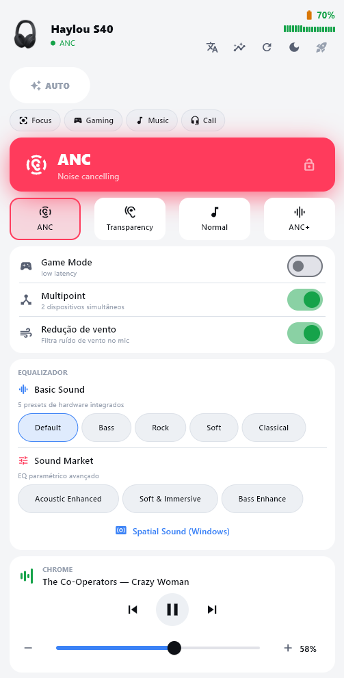

<div align="center">

# Haylou S40 — Windows Desktop App 🎧

**Control ANC, Transparency, Game Mode, Multipoint and Wind Reduction on your Haylou S40 straight from Windows — no phone, no mobile app.**
Smart auto-switch, scene profiles, hardware EQ and media controls, all in one window.

🇧🇷 [Versão em português](#-portugu%C3%AAs) · 🇺🇸 English below




</div>

## Why this exists

The official **Haylou Sound** app is **mobile-only**. If you live on your PC, there was no way to switch noise-cancelling modes, toggle Game Mode, or even check the battery without picking up your phone.

This is an independent **Windows** app that talks to the **Haylou S40** directly over **Classic Bluetooth (RFCOMM)** — the same protocol the phone app uses, reverse-engineered for interoperability. One window, global hotkeys, your headphones under control from the desktop.

## Features

- 🎚️ **ANC / Transparency / Normal / ANC+** — one click, or use global hotkeys from anywhere: `Ctrl+Alt+A` cycles, `Ctrl+Alt+1/2/0` jump straight to a mode, `Ctrl+Alt+G` toggles Game Mode
- 🎮 **Game Mode** (low latency), **Multipoint** (connect to 2 devices simultaneously) and **Wind Reduction** — all sent directly to the hardware over RFCOMM
- 🎯 **Scene profiles** — one click applies a combo: **Focus** (ANC + Soft EQ), **Gaming** (Game Mode + Normal), **Music** (ANC + Bass EQ), **Call** (Transparency)
- 🤖 **AUTO mode** — reads what you're doing (music → ANC, call → Transparency, game → Game Mode) and switches for you. Lock the mode anytime so AUTO stops touching it.
- 🧠 **Learns your habits, locally** — every manual choice is remembered (per app + time of day) so AUTO gets smarter. An **usage stats** screen shows what you use most. Stored only on your machine — nothing leaves the PC.
- 🔋 **Battery with low/critical alerts** and a **battery sparkline** (last hours), plus now-playing and media controls (play / pause / next / previous and real-time volume)
- 🎛️ **Hardware Equalizer** — **5 Basic Sound presets** (Default, Bass, Rock, Soft, Classical) and **3 Sound Market presets** (Acoustic Enhanced, Soft & Immersive, Bass Enhance), all applied directly to the headphone DSP
- 🔊 **Spatial Sound** (Windows Sonic) — one click opens the Windows spatial audio panel
- 🔄 **Reliable connection** — reconnects on its own over RFCOMM channel 10; a **Reconnect** button forces it. Remembers your last mode/EQ between sessions.
- 🌐 **English / Portuguese** — auto-detects your Windows language, switchable in one click
- 🪟 **System tray** with a color-coded current-mode icon (click it to cycle ANC, hover for battery), **minimize-to-tray on close**, **auto-start on boot** and **light / dark themes**
- 💎 Premium UI, fits in one window, ships ready to run — no Python install required

## Download

➡️ **[Download the latest release](../../releases/latest)** — unzip and run `Haylou S40.exe`. No installer, no dependencies.

> Requires Windows 10/11 with Bluetooth. Pair your Haylou S40 first; the app finds it automatically on first launch and remembers it.

**"Windows protected your PC"?** The build isn't code-signed (a signing cert costs money for a free project), so SmartScreen shows a warning. To run it: click **More info → Run anyway**. If you'd rather be sure, verify the download against the **SHA-256** published in the release notes:

```powershell
Get-FileHash "Haylou S40.exe" -Algorithm SHA256
```

Prefer not to trust a binary? [Build it yourself](#build-from-source) from source in one command.

## Supported devices

Built specifically for the **Haylou S40** over-ear headphone. The protocol was captured and confirmed via HCI snoop log — transport is **Classic Bluetooth RFCOMM on channel 10**, not BLE. Features confirmed: ANC (4 modes), Game Mode, Multipoint, Wind Reduction, Battery, and full hardware EQ (Basic Sound + Sound Market). The connection layer is config-driven, so other Haylou models using the same protocol can be adapted without touching the UI.

## How it works

The Haylou Sound app drives the headphones through **Classic Bluetooth RFCOMM** (channel 10, MAC OUI `24:B2:31`). The protocol was decoded from **live HCI snoop logs** captured via Android bug reports while using the official app.

- Frames: `AA BB CC C0 [opcode] [len] [sn] [payload] DD EE FF`
- `SET` (opcode `0x08`): writes attrs — ANC mode, Game Mode, Multipoint, Wind Reduction
- `SET_CONFIG` (opcode `0xF2`): writes EQ preset by config ID (`0x0007`)
- `SEND_EQ` (opcode `0x12`): sends Sound Market ASCII parametric EQ data
- `GET_RUN_INFO` (opcode `0x09`): reads current state via bitmask → TLV response
- Protocol details fully documented in [`docs/PROTOCOLO-REAL-S40.md`](docs/PROTOCOLO-REAL-S40.md)

> ⚠️ The app only ever sends **confirmed-safe commands** from captured traffic. No blind writes to unknown attributes.

## Build from source

```bash
pip install -r app/requirements.txt
python app/haylou_flet.py

# package into a standalone app (Windows):
powershell -File app/build_exe.ps1
```

## Tech stack

Python · [Flet](https://flet.dev) (Flutter-powered UI) · `socket.AF_BTH` (native Windows Classic Bluetooth RFCOMM) · [winsdk](https://pypi.org/project/winsdk/) (device discovery + now-playing via WinRT) · [pycaw](https://github.com/AndreMiras/pycaw) (volume) · [pystray](https://github.com/moses-palmer/pystray) (tray) · [PyInstaller](https://pyinstaller.org) (packaging).

## Privacy

Local-first by design. The app has **no analytics, no telemetry, no account, no server**. Everything — earbud control, battery, EQ, themes, AUTO learning — runs fully offline. Usage patterns (which mode you pick, per app + time of day) are stored only in `%APPDATA%\haylou-win\` as plain counts — no window titles, no audio, no text.

## Credits

Forked from the original work by **[Igor Silveira (@revolutedigital)](https://github.com/revolutedigital)**, who built the S30 Pro Windows app that this project is based on. The UI architecture, system integration layer and most of the application skeleton come from his work.

## Disclaimer

Independent, unofficial project. **Not affiliated with, endorsed by, or connected to Haylou or its manufacturer.** "Haylou" and "S40" are trademarks of their respective owners and are used here only to describe compatibility. Provided **as-is** for personal interoperability — use at your own risk.

## License

[MIT](LICENSE) © 2026 Igor Silveira

---

<a name="-português"></a>

# 🇧🇷 Português

**Controle ANC, Transparência, Game Mode, Multipoint e Redução de Vento do seu Haylou S40 direto do Windows — sem celular, sem app de telefone.**
Troca automática inteligente, perfis de cenário, equalizador de hardware e controles de mídia, tudo numa janela.

## Por que existe

O app oficial **Haylou Sound** é **só pra celular**. Quem vive no PC não tinha como trocar o modo de cancelamento de ruído, ligar o Game Mode ou nem ver a bateria sem pegar o telefone.

Este é um app **independente pra Windows** que fala direto com o **Haylou S40** por **Bluetooth Classic (RFCOMM)** — o mesmo protocolo do app do celular, reverso-engenheirado pra interoperabilidade.

## Funcionalidades

- 🎚️ **ANC / Transparência / Normal / ANC+** — um clique, ou atalhos globais: `Ctrl+Alt+A` cicla, `Ctrl+Alt+1/2/0` vão direto num modo, `Ctrl+Alt+G` liga/desliga o Game Mode
- 🎮 **Game Mode** (baixa latência), **Multipoint** (conecta em 2 dispositivos ao mesmo tempo) e **Redução de vento** — enviados direto ao hardware via RFCOMM
- 🎯 **Perfis de cenário** — um clique aplica um combo: **Foco** (ANC + EQ Suave), **Jogo** (Game Mode + Normal), **Música** (ANC + EQ Grave), **Call** (Transparência)
- 🤖 **Modo AUTO** — entende o que você está fazendo (música → ANC, call → Transparência, jogo → Game Mode) e troca sozinho. Trave o modo quando quiser que o AUTO pare de mexer.
- 🧠 **Aprende seus hábitos, localmente** — cada escolha manual é lembrada (por app + horário) e o AUTO fica mais esperto. Uma tela de **estatísticas** mostra o que você mais usa. Fica só na sua máquina — nada sai do PC.
- 🔋 **Bateria com alerta de baixa/crítica** e um **gráfico de bateria** (últimas horas), além de tocando-agora e controles de mídia com volume em tempo real
- 🎛️ **Equalizador de hardware** — **5 presets Basic Sound** (Default, Bass, Rock, Soft, Classical) e **3 presets Sound Market** (Acoustic Enhanced, Soft & Immersive, Bass Enhance), aplicados direto no DSP do fone
- 🔊 **Som Espacial** (Windows Sonic) — um clique abre o painel de áudio espacial do Windows
- 🔄 **Conexão confiável** — reconecta sozinho pelo canal RFCOMM 10; botão **Reconectar** força. Lembra o último modo/EQ entre sessões.
- 🌐 **Português / Inglês** — detecta o idioma do Windows, troca em um clique
- 🪟 **Bandeja do sistema** com ícone colorido do modo (clique pra ciclar o ANC, passe o mouse pra ver a bateria), **minimiza pra bandeja ao fechar**, **abre no boot** e **tema claro / escuro**

## Download

➡️ **[Baixe a última versão](../../releases/latest)** — descompacte e rode `Haylou S40.exe`. Sem instalador, sem dependências.

> Requer Windows 10/11 com Bluetooth. Pareie o Haylou S40 antes; o app encontra sozinho na primeira vez e lembra.

**"O Windows protegeu o seu PC"?** O app não é assinado (certificado custa caro pra um projeto grátis), então o SmartScreen avisa. Pra rodar: **Mais informações → Executar assim mesmo**.

## Créditos

Derivado do trabalho original de **[Igor Silveira (@revolutedigital)](https://github.com/revolutedigital)**, autor do app Windows para o S30 Pro do qual este projeto faz fork. A arquitetura de UI, a camada de integração com o sistema e o esqueleto da aplicação vêm do trabalho dele.

## Aviso

Projeto independente e não-oficial. **Sem afiliação, endosso ou conexão com a Haylou ou seu fabricante.** "Haylou" e "S40" são marcas dos respectivos donos, usadas aqui só pra descrever compatibilidade. Fornecido **como está**, pra interoperabilidade pessoal — use por sua conta e risco.

---

<sub>Keywords: Haylou S40 Windows app · controlar Haylou ANC no PC · Haylou desktop app · Haylou noise cancelling Windows · Haylou S40 PC software · app fone Bluetooth Windows · Haylou equalizador PC · apps sob encomenda · custom Windows apps developer.</sub>
